# Système de Gestion d'Inventaire pour un Magasin de Vêtements

Bienvenue dans l'application de gestion d'inventaire pour un magasin de vente.  
Cette application a été développé en utilisant Java hibernate et SQL Workbench pour la gestion de la base de donnée.    

### Fonctionnalités principales 
***
#### 1. Gestion de l'inventaire :

- Ajouter, modifier, supprimer et consulter les articles
- La recherche d'un article par son Id est également disponible.

#### 2. Gestion des ventes :

- Enregistrée les ventes réalisées liés aux clients et aux articles
- Suivre l'état d'une commande
- Généré un reçu pour les clients

#### 3. Gestion des clients :

- Ajouter, modifier, supprimer et consulter les infos des clients.
- La recherche d'un client par son Id est également disponible.
- Historique d'achat

#### 4. Rapport et Statistiques :

- Générer des rapports sur les stocks disponible.
- Généré des rapportssur les ventes réalisées.

### Avant le développement 

Avant de commencer le développement de l'application, 
j'ai réalisé les diagrammes suivants pour planifier et visualiser
la structure et les fonctionnalités de l'application :

#### Diagramme de cas d'utilisation : 

Ce diagramme montre les différents cas d'utilisation de l'application
et les interactions des utilisateurs avec le système.

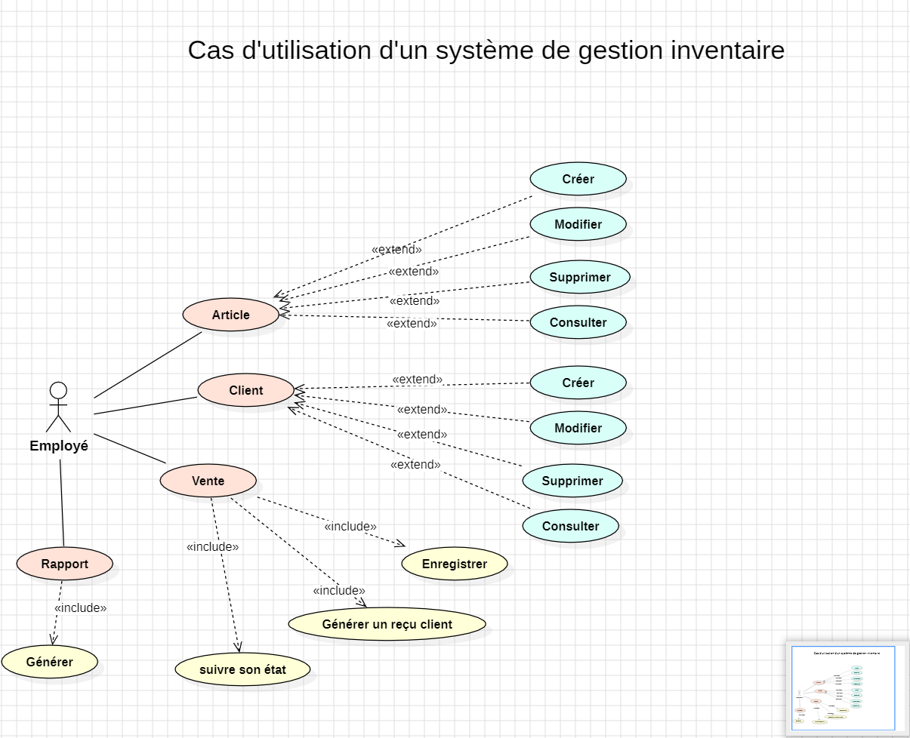 

le lien ➡️ [Usecase](src/main/Diagramme/useCaseGestionInventaire.mdj)

#### Diagramme UML :

Ce diagramme UML représente les entités de mon application et
leurs relations. Cela m'a aidé à structurer la base de données 
et à définir les interactions entre les différentes entités.

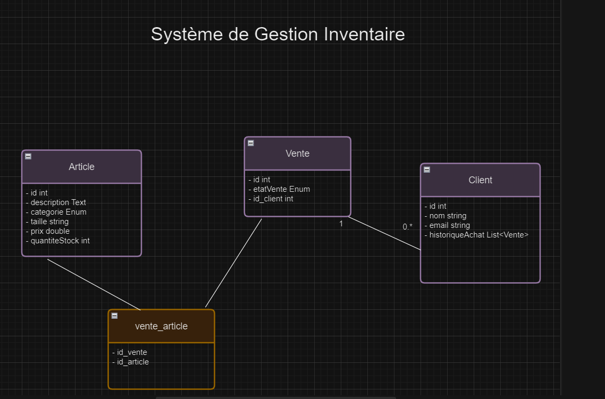

le lien ➡️ [UML](src/main/Diagramme/systemeDeGestionInventaire.drawio)

### Guide  de démarrage rapide 

#### Configuration de la base de donnée

- Ouvrez SQL Workbench et connectez-vous à votre serveur de base de données.
- Créez une nouvelle base de données nommée "gestionInventaire".  
  **Attention** Si vous décidez de changer le nom de la base de donné, assurez vous de le modifier également dans le fichier hibernate.properties.

#### Installation et configuration de l'application 

- Clonez ce dépôt sur votre machine locale.
- Assurez-vous que vous avez Maven installé.
- Ouvrez le fichier hibernate.properties et mettez à jour les paramètres de connexion à votre base de données.
- Assurez-vous que les dépendances nécessaires sont ajoutées dans votre fichier pom.xml, y compris Hibernate Entity Manager, MySQL Connector Java et Lombok.

#### Structure du projet 

- org.exemple
  - entity 
  - Ihm
  - interfaces
  - util
  - service
  - ©️Main
- 📁ressources

    - hibernate.cfg.xml
    - hibernate.propertie

##### Entity : 
Contient les classes qui représentent les entités de 
mon application. Ces entités sont annotées avec des annotations Hibernate et utilisent Lombok pour générer automatiquement des méthodes (@data, @AllArgsConstructor etc...) 
##### Ihm : 
Ce package contient les interfaces homme-machine (IHM) pour différentes
fonctionnalités de mon application. Je possède une IHM pour 
chaque entité et une classe de base qui récupère ces IHM. 
##### Interfaces : 
Ce package contient une interface nommée Repository qui définit 
les opérations de base de manipulation des données telles
que la création, la mise à jour, la suppression, lz modification, la recherche par 
identifiant et la récupération d'une liste.
##### Util :
Ce package contient des classes utilitaires, notamment des énumérations
utilisées dans mon application.
##### Service : 
Ce package contient les classes de service qui gèrent la logique 
métier de chaque entité. Ces classes étendent une classe abstraite 
BaseService qui initialise la session Hibernate.
##### Main
Ce package contient la classe principale de mon application, elle possède une méthode main
où la base IHM est appelée pour démarrer l'application.

## Les Fonctionnalités

#### Design pattern utilisé : Singleton

Pour gérer l'intégralité de mon application, j'ai mis en place
un design pattern Singleton pour la classe `BaseIhm`. Le pattern
Singleton est utilisé pour m'assurer qu'une classe n'a qu'une 
seule instance et pour fournir un point d'accès global à cette
instance.

Mon menu de base pour gérer et accéder à toute mon application : 

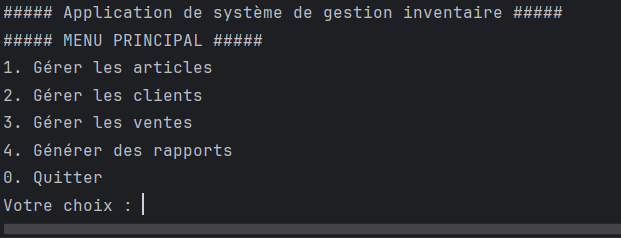
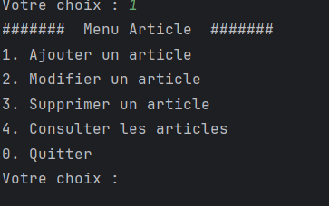
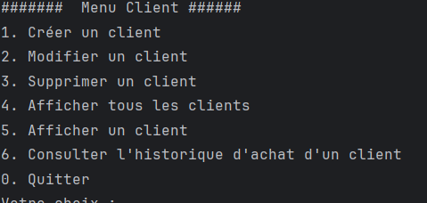
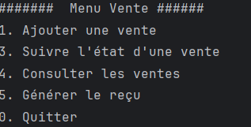
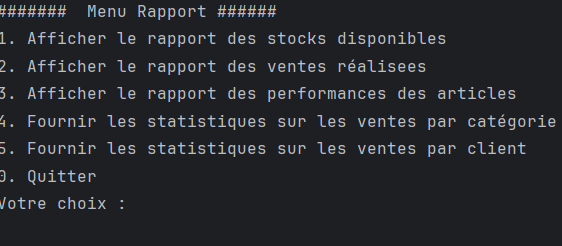

#### Articles

Mon application permet d'ajouter, de modifier, de supprimer un article.
Elle permet également d'afficher la liste des articles.

Testons la : 

- Ajouter 

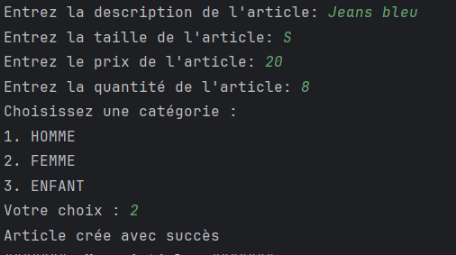
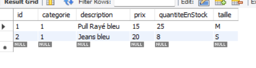

- Modifier 

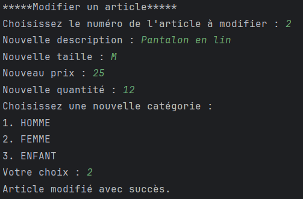
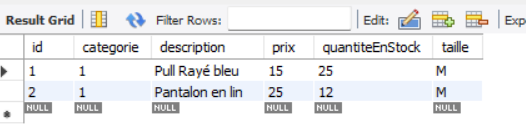

- supprimer 

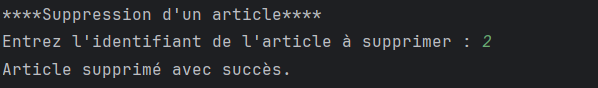
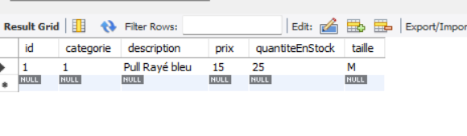

- Afficher la liste 

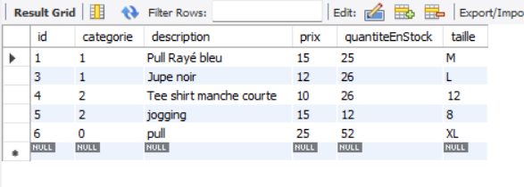

#### Client 

Mon application permet d'ajouter, de modifier, de supprimer, et afficher un client.
Elle permet également d'afficher la liste des clients.
Et aussi de consulter l'historique d'achat d'un client.

- Ajouter 

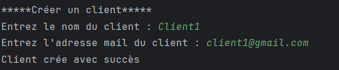
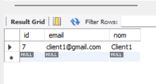

- Modifier

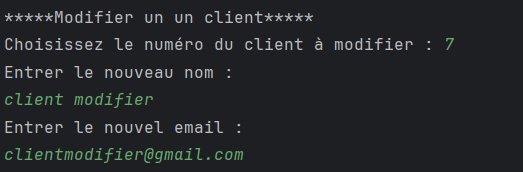
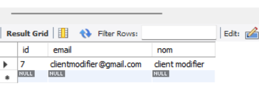

- Supprimer

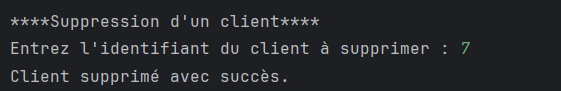
J'ai ajouter un nouveau client, le client avec l'id 7 a bien été supprimé
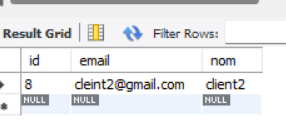

- Rechercher un client 

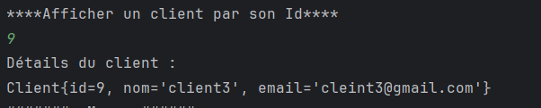

- Liste 

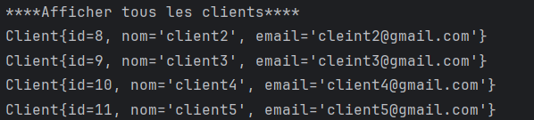
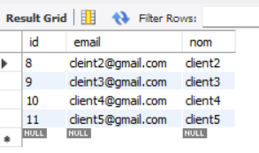

- Historique d'achat du client 

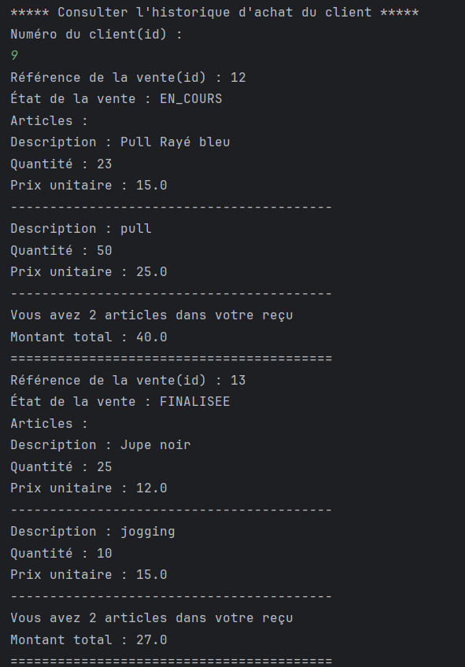

#### Vente 

L'application permet de réalisé une vente lié aux clients et aux articles, de suivre l'état d'une 
commande, et de généré un reçu pour le client

- Créer une vente lié aux clients et aux articles

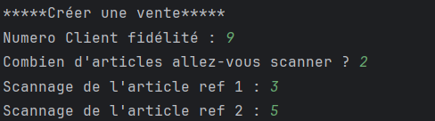
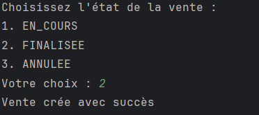
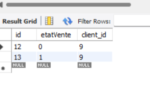
Table de liaison (ManyToMany) : 
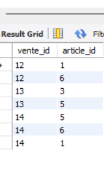

- Suivre l'état d'une vente 

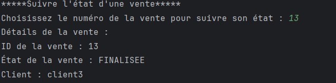

- Générer un reçu pour le Client 

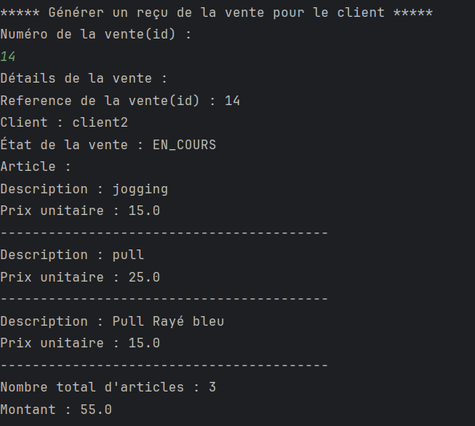

A noter, que quand je crée une vente le stock des articles en cours diminue
Vente avec l'article Id1
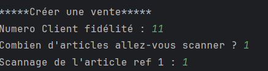

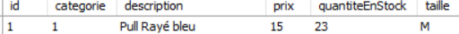

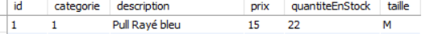

#### Rapport

Je peux générer des rapports via l'application, rapport sur les stocks disponible et rapport sur
les ventes réalisées 

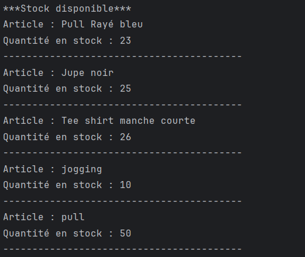 

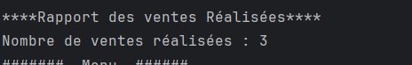

Lien du dossier image ➡️ [Image](src/main/imgApplication)

    

